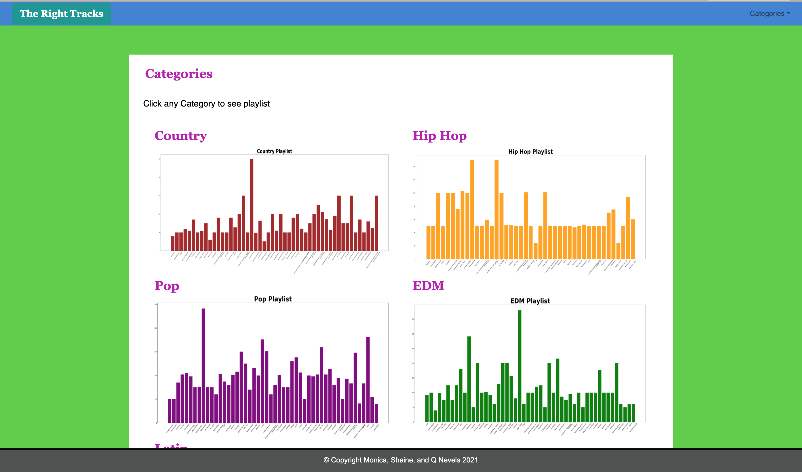

# The Right Tracks

## Background
Have you ever been in a rush and just wanted to listen to some music but didn't feel like creating your own playlist or annouyed with the songs that shuffle picks for you??? Well.. we have the page just for you!!!!!

 

## What We Did!!!

Using a Spotify API we pulled 5 Categories
* Country 
* EDM
* Pop
* Hip Hop
* Latin

Used Jupyter Notebook to create a CSV file with all the files.

## Created a SQLite database

* Then used SQL alchemy to get into a flask app.py

## Developed Web Page

* Interactive Webpage were users can click on category of music that they want to listen to and then pick which playlist they want 

## Future Plans

* Once user clicks on playlist, playlist loads to p/c or mobile device and user can play.

## Contributors are Monica, Shaine, and Q. Nevels
